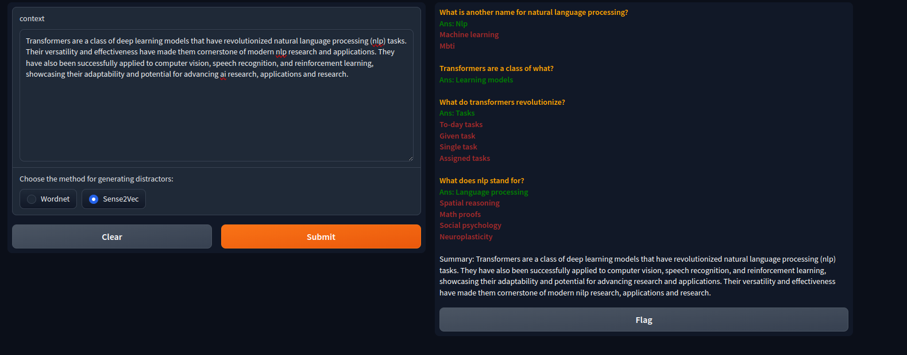
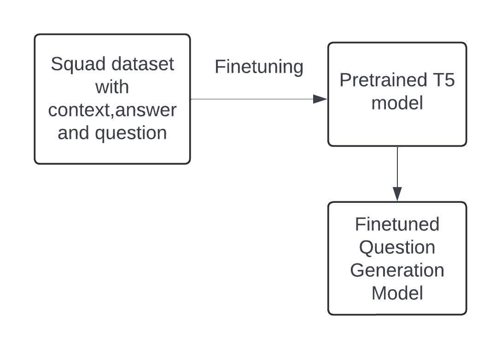
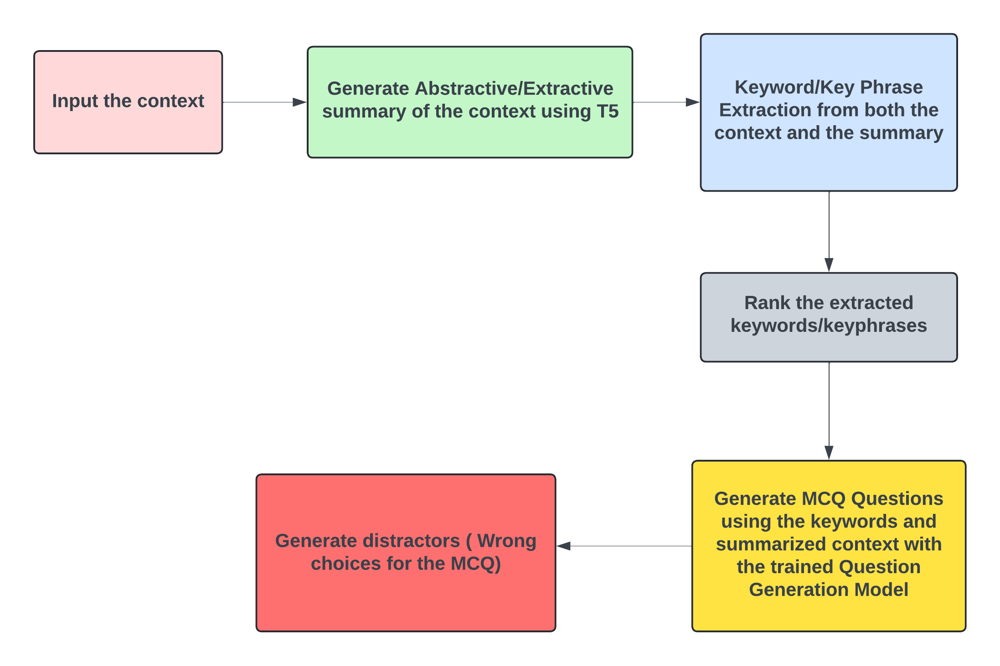

# Question and MCQ Generation 

## Project Overview:
Our project automate the process of generating questions from text passages.Here, we have finetuned T5-small model for question generation. and used the same finetuned model for MCQ generation.

## Acces our training notebooks and models
- Access our **Colab notebook** [here](https://colab.research.google.com/drive/1vn_BxUOoE6cgqK57jkEBYs-yXNtTWbcW?usp=sharing).
- Acces our Question Generation Model on Hugging Face [here](https://huggingface.co/nadika/question_generation_final)
- Training notebook on Kaggle [here](https://www.kaggle.com/code/mahimadhakal/questiongenerator?scriptVersionId=171923165)

## View our Demo: 

## System diagram for finetuning T5-small model for Question Generation

## System diagram for MCQ generation workflow

**Workflow steps:**

