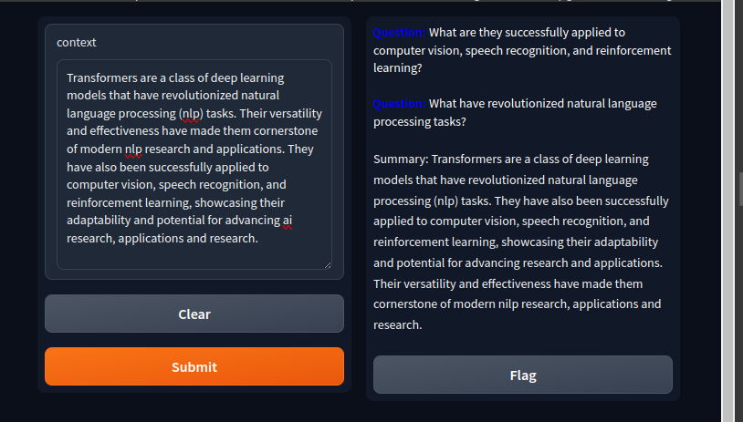
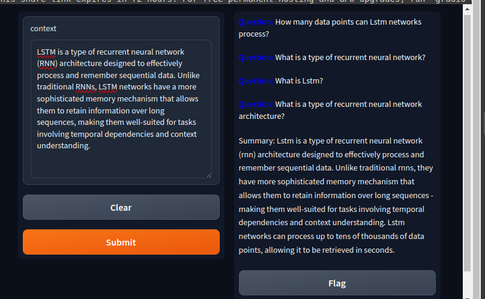
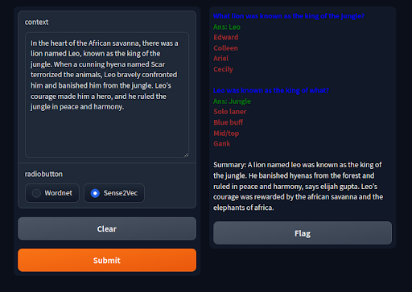
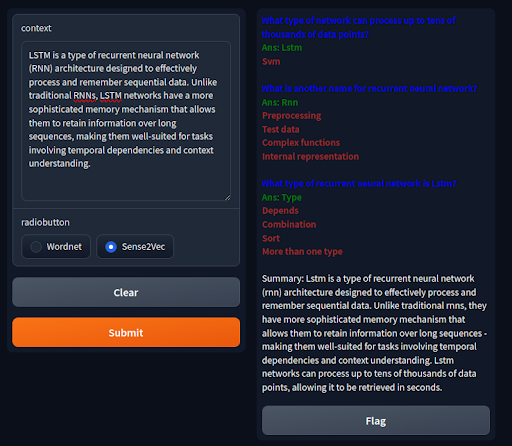
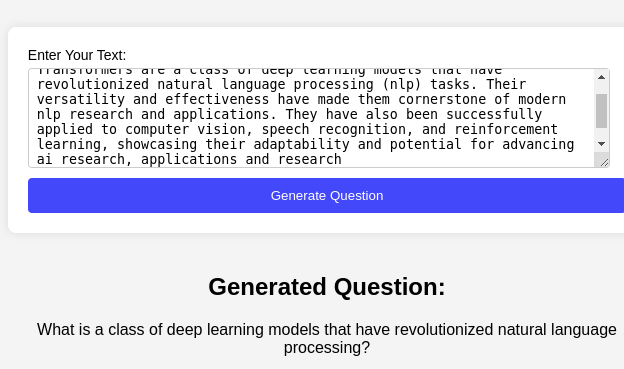
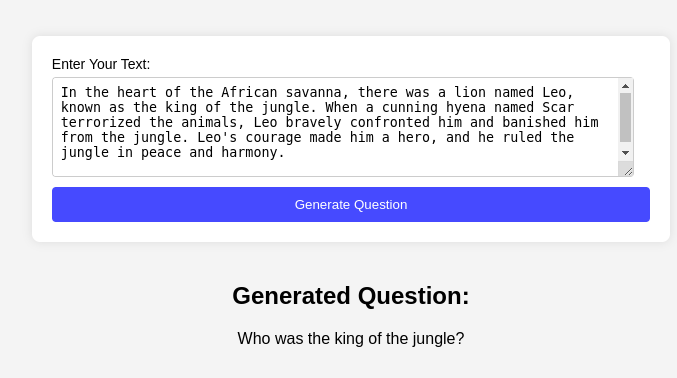

# Question and MCQ Generation 

## Project Overview:
Our project automate the process of generating questions from text passages.Here, we have finetuned T5-small model for question generation. and used the same finetuned model for MCQ generation.

## Acces our training notebooks and models
- Access our **Colab notebook** [here](https://colab.research.google.com/drive/1vn_BxUOoE6cgqK57jkEBYs-yXNtTWbcW?usp=sharing).
- Acces our Question Generation Model on Hugging Face [here](https://huggingface.co/nadika/question_generation_final)
- Training notebook on Kaggle [End to End Generation] [here](https://www.kaggle.com/code/mahimadhakal/questiongenerator?scriptVersionId=171923165)

## View our Demo: 

## Run
- Clone the repository : `git clone git@github.com:Nadika18/Question_Generation.git    `
- Install the requirements : `pip install -r requirements.txt`
- Run `python3 manage.py runserver` in the terminal
- Open the browser and go to `http://localhost:8000/`
- Submit the question at `/`
- Get the generated question at `/submit-question`

## System diagram for finetuning T5-small model for Question Generation

## System diagram for MCQ generation workflow

## Outputs:
### 1. Question Generation:

### 2. MCQ Generation:

## Question Generation without Answers : End to End Generation

 **TrainingArguments**   

| Parameter                        | Value                  | 
|----------------------------------|------------------------|
| `evaluation_strategy`            | `epoch`                |  
| `learning_rate`                  | `2e-5`                 | 
| `per_device_train_batch_size`    | `8`                    | 
| `per_device_eval_batch_size`     | `8`                    | 
| `num_train_epochs`               | `3`                    | 
| `weight_decay`                   | `0.01`                 | 
| `save_strategy`                  | `epoch`                | 
| `disable_tqdm`                   | `False`                | 
| `gradient_accumulation_steps`    | `2`                    | 

 Note : The batch size and acclumulation steps were decreased during training due to memory constraints.

